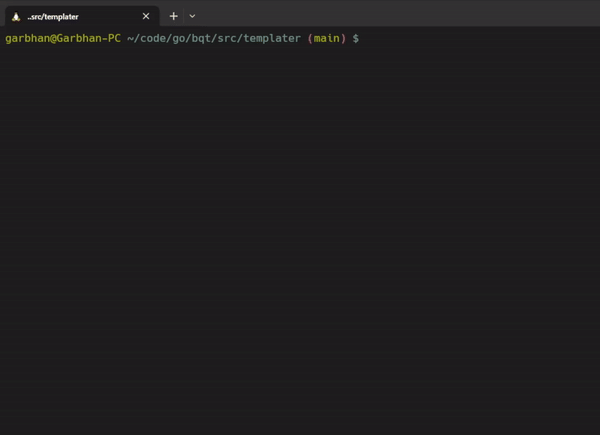

# BQT

- BigQuery templating cli app
- made for quickly copy/pasting airflow templated sql into BigQuery UI
- reads from a `mapping.json` file
- can convert most built-in airflow template values
- support for an environment variable with `${env}`



### Setup
- create a folder `${HOME}/Documents/bqt`
- create a `mappings.json` file with template names as keys and the desired unput as values

```json
{
    "params.project": "gk-africa-data-eu-${env}",
    "params.web_project": "testscore-web",
    "environment": "${env}"
}
```

### Usage
- `file` (required)
- `env` (optional), either "live", "dev", or "staging"
- `isTest` (optional), read from the `mapping.json` in main package
- `quiet` (optional), 
- `isTerraform` (optional), switches from jinja templating (`{{ }}`) to terraform (`${}`)

```bash
# bqt <file> <env>

bqt users.sql live quiet
```

**mapping.json**
- templated values are read from the `mapping.json` file
- keys are the templated values and values are the what you sub in

